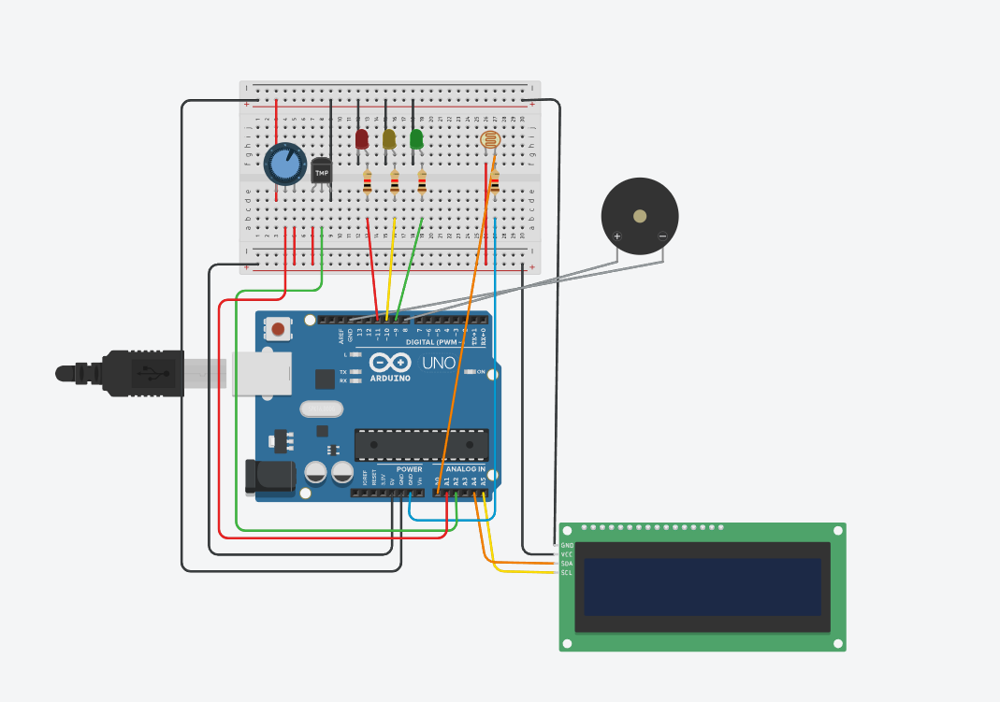

<h1 align="center">🍷 Vinheria Agnelo Inteligente com Arduino</h1>
<h2 align="center">🌡️ Monitoramento de Temperatura e Umidade</h2>

  
  
  

---

📌 Sobre o Projeto

## 🖼️ Montagem do Circuito
---

  

  🔌 Representação do circuito montado no Tinkercad com Arduino Uno, sensor DHT11 e display LCD

---

### 🔍 Entendendo a ligação (explicação simples)

- 🔌 **Arduino Uno** → funciona como o cérebro do sistema, controlando todos os componentes  
- 🌗 **Sensor de luminosidade (LDR)** → mede a quantidade de luz no ambiente  
- 🌡️ **Sensor DHT11** → mede a temperatura e a umidade do ambiente em tempo real  
- 📟 **Display LCD** → mostra as informações para o usuário (temperatura, umidade e status do sistema)  

- 💡 **LEDs (indicadores de luminosidade)** → representam visualmente o nível de luz do ambiente:
  - 🟢 **LED verde** → luminosidade ideal (ambiente adequado para armazenamento)  
  - 🟡 **LED amarelo** → luminosidade moderada (nível de atenção)  
  - 🔴 **LED vermelho** → luminosidade alta (situação crítica, pode prejudicar o vinho)  

- 🧩 **Protoboard** → usada para organizar as conexões sem precisar soldar  
- 🔗 **Jumpers (fios)** → fazem a comunicação entre todos os componentes  

---

👉 O funcionamento do sistema acontece da seguinte forma:

1. O sensor LDR mede a luminosidade do ambiente  
2. O sensor DHT11 mede a temperatura e a umidade  
3. O Arduino recebe todos esses dados e faz a análise  
4. Com base nas condições, ele executa duas ações:
   - Exibe as informações no display LCD  
   - Acende o LED correspondente ao nível de luminosidade  

---

- 📟 Pelo **display LCD** → informações completas (temperatura, umidade e status)  
- 💡 Pelos **LEDs** → resposta rápida sobre a luminosidade  

---

👉 Esse tipo de sistema é utilizado na vida real para monitoramento de ambientes sensíveis, como adegas, laboratórios e estoques, garantindo condições ideais de conservação.

---

### 💡 O que está acontecendo na prática?

1. O sensor lê o ambiente (temperatura e umidade)  
2. O Arduino processa essas informações  
3. O sistema decide se está tudo OK ou se há problema  
4. O resultado aparece no display LCD em tempo real  

---

Nosso projeto simula uma adega inteligente, ou seja, um sistema automatizado que monitora o ambiente onde os vinhos estão armazenados.

👉 Mas por que isso é importante?

Vinhos precisam ficar em condições específicas para não perder qualidade. Dois fatores são essenciais:

- 🌡️ Temperatura
- 💧 Umidade

Se esses fatores saem do ideal, o vinho pode estragar.

👉 É aí que entra o Arduino: ele funciona como o “cérebro” do sistema, monitorando tudo automaticamente.

---

## 🧩 O que cada parte do sistema faz (explicação simples)

---

### 🔌 Arduino Uno (o cérebro)  
Recebe todas as informações dos sensores, toma decisões e controla os LEDs e o display.  

---

### 🌗 Sensor de luminosidade (LDR)  
Mede a quantidade de luz no ambiente.  
👉 Quanto mais luz, menor a resistência; quanto menos luz, maior a resistência.  

---

### 🌡️ Sensor DHT11  
Mede:  
- Temperatura do ambiente  
- Umidade do ar  

👉 Envia esses dados constantemente para o Arduino.  

---

### 📟 Display LCD  
Mostra as informações para o usuário:  
- Temperatura  
- Umidade  
- Status do sistema  

👉 Funciona como uma “tela informativa”.  

---

### 💡 LEDs (sistema de iluminação/alerta visual)  
Funcionam como um indicador rápido da **luminosidade do ambiente**:

- 🟢 **LED verde** → luz ideal (condição adequada)  
- 🟡 **LED amarelo** → luz moderada (atenção)  
- 🔴 **LED vermelho** → luz alta (situação crítica)  

👉 Assim, o usuário consegue entender o ambiente **sem precisar ler o display**.  

---

### 🧩 Protoboard  
Organiza as conexões sem necessidade de solda.  

---

### 🔗 Jumpers (fios)  
Responsáveis por conectar todos os componentes entre si.  

🔧 Potenciômetro

Controla o contraste do display (deixa a tela mais clara ou mais escura).

⚙️ Componentes Utilizados

---

- 🔌 Arduino Uno
- 🌡️ Sensor DHT11
- 📟 Display LCD 16x2
- 🎚️ Potenciômetro
- 🔩 Resistores
- 🧩 Protoboard
- 🔗 Jumpers
- 🌗 Sensor de luminosidade (LDR)
- 🟢🔴 Leds

---

🔋 Como o sistema funciona (passo a passo)

🥇 1. Medição do ambiente

O sensor DHT11 mede constantemente:

- Temperatura
- Umidade

 Mesmo sem você fazer nada, ele já está coletando dados.

 ---

🥈 2. Envio das informações

O sensor envia esses dados para o Arduino.

 Aqui acontece a “comunicação” entre os componentes.

 ---

🥉 3. Análise pelo Arduino

O Arduino verifica se os valores estão dentro do ideal.

Exemplo de lógica:

- Temperatura muito alta → problema
- Umidade muito baixa → problema
- Tudo normal → ambiente OK

---

🏁 4. Exibição no LCD

O display mostra tudo em tempo real:

Temp: 25°C  Umid: 60%
Status: OK

Ou, em caso de problema:

Temp: 32°C
ALERTA: TEMP ALTA

---

🧠 Lógica do Sistema (como o Arduino “pensa”)

float temperatura = dht.readTemperature();
float umidade = dht.readHumidity();

if (temperatura > 30) {
  // Temperatura alta
}
else if (umidade < 40) {
  // Umidade baixa
}
else {
  // Ambiente ideal
}

👉 O Arduino usa decisões simples (if/else), como se fosse um “SE isso acontecer → FAÇA aquilo”.

---

📊 Exemplo de funcionamento

| Situação do Ambiente | O que aparece no LCD |
| -------------------- | -------------------- |
| Tudo normal          | ✅ Status OK          |
| Temperatura alta     | ⚠️ Temp Alta         |
| Umidade baixa        | ⚠️ Umidade Baixa     |

---

🔍 Observação Técnica

Os valores de temperatura e umidade considerados ideais podem ser ajustados no código.

👉 Isso permite adaptar o sistema para diferentes tipos de vinho ou ambientes.

---

🎯 Objetivos do Projeto

- ✔ Aprender como funciona o Arduino
- ✔ Trabalhar com sensores reais (DHT11)
- ✔ Exibir dados em um display LCD
- ✔ Criar lógica de decisão (if/else)
- ✔ Simular automação do mundo real

---

🛠️ Tecnologias Utilizadas

    

---

🔗 Acesse o Projeto

---

👉 Tinkercad:
https://www.tinkercad.com/things/flx3Ey7xao8-copy-of-lcd-i2c/editel?returnTo=https%3A%2F%2Fwww.tinkercad.com%2Fdashboard&sharecode=3tH6NNJ3n_HNn-PRwhsgSERpuG9ZKq28XKoREHgrQRU

---

👉 YouTube:
https://www.youtube.com/watch?v=uro7mXzho0c

---

👨‍💻 Integrantes
- Rafael Taboada Sobral
- Guilherme Mazzini Nunes Canno
- Luan Schinello Garbin
- Beatriz de Araujo Périgo

---

🏫 Contexto Acadêmico

Projeto desenvolvido para o Checkpoint 2 da FIAP, sob orientação do professor Lucas Demetrius Augusto.
